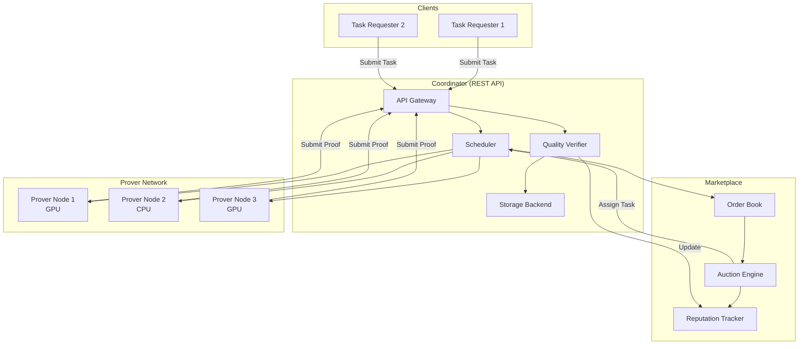
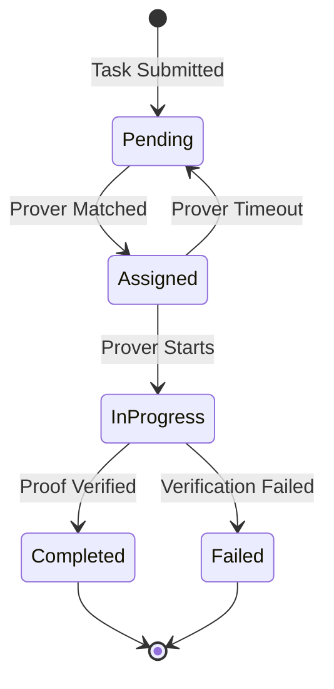

# NexusZero Distributed Proof Generation Network (DPGN)

A high-performance, decentralized network for distributing zero-knowledge proof generation across multiple prover nodes with marketplace-based task allocation and quality verification.

## Overview

The DPGN enables scalable zero-knowledge proof generation by:

- **Distributing workload** across a network of prover nodes
- **Matching tasks with provers** through reputation-weighted auctions
- **Ensuring proof quality** via automated verification
- **Incentivizing performance** through a reward-based marketplace

## Architecture



### ASCII Architecture Diagram

```
┌─────────────────────────────────────────────────────────────────────────────┐
│                    DPGN - Distributed Proof Generation Network              │
├─────────────────────────────────────────────────────────────────────────────┤
│                                                                             │
│  ┌─────────────┐     ┌─────────────┐     ┌─────────────┐                   │
│  │   Client    │     │   Client    │     │   Client    │                   │
│  │ (Requester) │     │ (Requester) │     │ (Requester) │                   │
│  └──────┬──────┘     └──────┬──────┘     └──────┬──────┘                   │
│         │                   │                   │                           │
│         └───────────────────┼───────────────────┘                           │
│                             ▼                                               │
│  ┌──────────────────────────────────────────────────────────────────────┐  │
│  │                         COORDINATOR                                   │  │
│  │  ┌────────────┐  ┌────────────┐  ┌────────────┐  ┌────────────────┐  │  │
│  │  │  REST API  │──│ Scheduler  │──│  Quality   │──│    Storage     │  │  │
│  │  │            │  │            │  │  Verifier  │  │    Backend     │  │  │
│  │  └────────────┘  └────────────┘  └────────────┘  └────────────────┘  │  │
│  └──────────────────────────┬───────────────────────────────────────────┘  │
│                             │                                               │
│  ┌──────────────────────────┼───────────────────────────────────────────┐  │
│  │                      MARKETPLACE                                      │  │
│  │  ┌────────────┐  ┌────────────────┐  ┌──────────────────────────┐    │  │
│  │  │ Order Book │──│ Auction Engine │──│   Reputation Tracker     │    │  │
│  │  │ (Bids/Asks)│  │ (Weighted Algo)│  │ (Success Rate, Quality)  │    │  │
│  │  └────────────┘  └────────────────┘  └──────────────────────────┘    │  │
│  └──────────────────────────┬───────────────────────────────────────────┘  │
│                             │                                               │
│         ┌───────────────────┼───────────────────┐                           │
│         ▼                   ▼                   ▼                           │
│  ┌─────────────┐     ┌─────────────┐     ┌─────────────┐                   │
│  │ Prover Node │     │ Prover Node │     │ Prover Node │                   │
│  │   (GPU)     │     │   (CPU)     │     │   (GPU)     │                   │
│  └─────────────┘     └─────────────┘     └─────────────┘                   │
│                                                                             │
└─────────────────────────────────────────────────────────────────────────────┘
```

## Components

### 1. Prover Node (`prover_node`)

The prover node is responsible for generating zero-knowledge proofs.

**Key Features:**

- Registers with the coordinator and advertises capabilities
- Supports both CPU and GPU proof generation
- Manages a local task queue for concurrent proof processing
- Submits completed proofs back to the coordinator

**Configuration:**

```rust
use prover_node::{ProverConfig, ProverNode};
use uuid::Uuid;

let config = ProverConfig {
    node_id: Uuid::new_v4(),
    gpu_enabled: true,
    max_concurrent_proofs: 4,
    supported_privacy_levels: vec![1, 2, 3],
    coordinator_url: "http://localhost:8080".to_string(),
    reward_address: "0x...".to_string(),
};

let node = ProverNode::new(config).await?;
node.start().await?;
```

### 2. Marketplace (`marketplace`)

The marketplace matches task requesters with provers through an auction system.

**Components:**

- **Order Book**: Manages bids (from requesters) and asks (from provers)
- **Auction Engine**: Selects optimal provers using reputation-weighted scoring
- **Reputation Tracker**: Tracks prover performance metrics

**Auction Scoring:**

```rust
use marketplace::{AuctionConfig, AuctionEngine, OrderBook, ReputationTracker};

let config = AuctionConfig {
    price_weight: 0.7,      // 70% weight on price
    reputation_weight: 0.3, // 30% weight on reputation
};

let engine = AuctionEngine::with_config(config);
let result = engine.run_auction_with_reputation(&order_book, &reputation_tracker, 10);
```

**Reputation Score Calculation:**

- 50% Success Rate (successful_proofs / total_proofs)
- 30% Quality Score (average proof quality)
- 20% Time Efficiency (faster generation = higher score)

### 3. Coordinator (`coordinator`)

The central REST API server that orchestrates the entire network.

**Responsibilities:**

- Accept and store proof task submissions
- Manage prover registration and health monitoring
- Assign tasks to available provers based on capabilities
- Verify proof quality and update reputation scores
- Store completed proof results

## Quick Start

### 1. Start the Coordinator

```rust
use proof_network_coordinator::{router, CoordinatorState, SharedState};
use std::sync::Arc;
use tokio::sync::Mutex;

#[tokio::main]
async fn main() {
    // Initialize coordinator state
    let state: SharedState = Arc::new(Mutex::new(CoordinatorState::new()));

    // Create the router
    let app = router(state);

    // Start the server
    let listener = tokio::net::TcpListener::bind("0.0.0.0:8080").await.unwrap();
    axum::serve(listener, app).await.unwrap();
}
```

### 2. Register a Prover

```bash
curl -X POST http://localhost:8080/provers/register \
  -H "Content-Type: application/json" \
  -d '{
    "prover_id": "550e8400-e29b-41d4-a716-446655440000",
    "supported_levels": [1, 2, 3],
    "capacity": 5
  }'
```

### 3. Submit a Proof Task

```bash
curl -X POST http://localhost:8080/tasks \
  -H "Content-Type: application/json" \
  -d '{
    "task_id": "660e8400-e29b-41d4-a716-446655440001",
    "privacy_level": 2,
    "circuit_data": [1, 2, 3, 4],
    "reward_amount": 100,
    "requester": "client-001",
    "priority": 10
  }'
```

### 4. Prover Fetches Task

```bash
curl -X GET http://localhost:8080/tasks/assign/550e8400-e29b-41d4-a716-446655440000
```

### 5. Submit Proof Result

```bash
curl -X POST http://localhost:8080/tasks/result \
  -H "Content-Type: application/json" \
  -d '{
    "task_id": "660e8400-e29b-41d4-a716-446655440001",
    "prover_id": "550e8400-e29b-41d4-a716-446655440000",
    "proof": [10, 20, 30, 40, 50]
  }'
```

## API Reference

### Task Management

| Endpoint                   | Method | Description                |
| -------------------------- | ------ | -------------------------- |
| `/tasks`                   | POST   | Submit a new proof task    |
| `/tasks/:task_id/status`   | GET    | Get task status            |
| `/tasks/assign/:prover_id` | GET    | Get next task for a prover |
| `/tasks/result`            | POST   | Submit completed proof     |

### Prover Management

| Endpoint             | Method | Description                 |
| -------------------- | ------ | --------------------------- |
| `/provers`           | GET    | List all registered provers |
| `/provers/register`  | POST   | Register a new prover       |
| `/provers/heartbeat` | POST   | Send prover heartbeat       |

### Request/Response Schemas

#### POST `/tasks` - Submit Task

**Request:**

```json
{
  "task_id": "uuid",
  "privacy_level": 1-255,
  "circuit_data": [bytes],
  "reward_amount": 100,
  "requester": "string",
  "priority": 0-100
}
```

**Response:**

```json
"uuid"
```

#### POST `/provers/register` - Register Prover

**Request:**

```json
{
  "prover_id": "uuid",
  "supported_levels": [1, 2, 3],
  "capacity": 5
}
```

**Response:**

```json
"uuid"
```

#### GET `/tasks/assign/:prover_id` - Assign Task

**Response:**

```json
{
  "task_id": "uuid",
  "privacy_level": 2,
  "circuit_data": [1, 2, 3],
  "reward_amount": 100,
  "requester": "client-001",
  "priority": 10
}
```

_Returns `null` if no matching task is available._

#### POST `/tasks/result` - Submit Proof Result

**Request:**

```json
{
  "task_id": "uuid",
  "prover_id": "uuid",
  "proof": [bytes]
}
```

**Response:**

```json
{
  "accepted": true,
  "verification_result": "Pass",
  "quality_score": 0.95
}
```

#### GET `/tasks/:task_id/status` - Get Task Status

**Response:**

```json
{
  "task_id": "uuid",
  "status": "pending|assigned|in_progress|completed|failed",
  "assigned_prover": "uuid|null",
  "created_at": "2025-01-01T00:00:00Z",
  "updated_at": "2025-01-01T00:01:00Z"
}
```

## Configuration Options

### Prover Node Configuration

| Option                     | Type    | Default | Description                         |
| -------------------------- | ------- | ------- | ----------------------------------- |
| `node_id`                  | UUID    | -       | Unique identifier for this prover   |
| `gpu_enabled`              | bool    | false   | Enable GPU-accelerated proving      |
| `max_concurrent_proofs`    | usize   | 1       | Maximum parallel proof jobs         |
| `supported_privacy_levels` | Vec<u8> | []      | Privacy levels this prover supports |
| `coordinator_url`          | String  | -       | URL of the coordinator API          |
| `reward_address`           | String  | -       | Address for receiving rewards       |

### Auction Configuration

| Option              | Type | Default | Description                              |
| ------------------- | ---- | ------- | ---------------------------------------- |
| `price_weight`      | f64  | 0.7     | Weight for price in auction scoring      |
| `reputation_weight` | f64  | 0.3     | Weight for reputation in auction scoring |

### Coordinator Configuration

The coordinator uses an in-memory storage backend by default. For production deployments, configure persistent storage.

## Task Lifecycle



## Running Tests

```bash
# Run all proof_network tests
cargo test -p proof_network-coordinator
cargo test -p proof_network-marketplace
cargo test -p prover_node

# Run with logging
RUST_LOG=debug cargo test -p proof_network-coordinator -- --nocapture
```

## Crate Structure

```
proof_network/
├── coordinator/          # Central REST API
│   └── src/
│       ├── lib.rs        # Main coordinator logic & API handlers
│       ├── quality.rs    # Proof quality verification
│       ├── scheduler.rs  # Task scheduling algorithms
│       └── storage.rs    # Storage backends
├── marketplace/          # Auction & order book
│   └── src/
│       ├── lib.rs        # Re-exports
│       ├── auction.rs    # Auction engine
│       ├── order_book.rs # Bid/ask order book
│       └── reputation.rs # Prover reputation tracking
└── prover_node/          # Proof generation node
    └── src/
        ├── lib.rs        # Prover node logic
        └── cpu.rs        # CPU prover implementation
```

## License

See [LICENSE](../LICENSE) for details.
